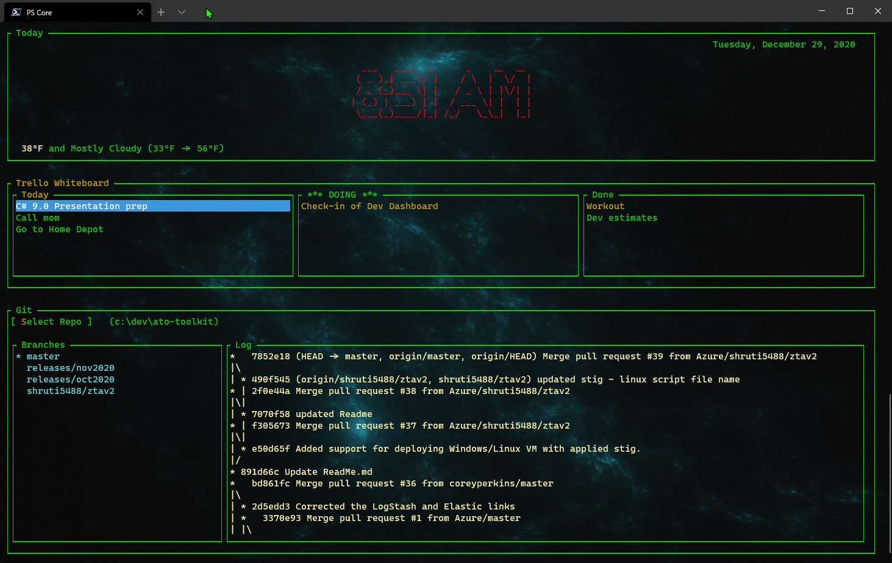

# Dev Dashboard

A C# [Gui.cs](https://github.com/migueldeicaza/gui.cs)-based developer dashboard. This was inspired by [Elijah Manor](https://elijahmanor.com/)'s [Terminal Dashboard with react-blessed](https://elijahmanor.com/blog/react-blessed).

Currently includes:

* Date/time
* Weather
* Trello integrattion
* Local git repo visualization

Remaining items:

* Removing hard-coding of git integration
* Adding any new utilities

